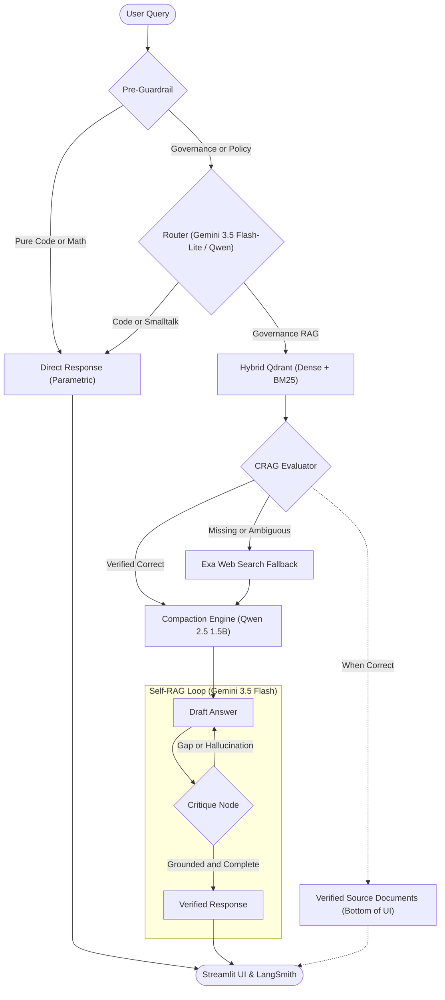

# Press Release RAG

An enterprise-grade, agentic governance intelligence engine built on official **Press Information Bureau (PIB) 2026** Government of India records. 

This platform couples **Front-Door Query Routing** (with dual Gemini 3.5 Flash-Lite / local Qwen 2.5 backends and deterministic guardrails), **Hybrid Vector Retrieval** (Dense + BM25 Sparse with Reciprocal Rank Fusion), **Corrective RAG (CRAG)** for factual validation, **Single-Pass Knowledge Compaction**, and a **Self-RAG LangGraph Synthesis Loop** (powered by Gemini) featuring multi-hop critique, hallucination detection, transparent verified document citations, and real-time **LangSmith** thinking trace visualization.

---

## Architecture Overview



---

## Required APIs and Models

### 1. Cloud APIs
| API | Environment Variable | Purpose | How to Obtain |
|---|---|---|---|
| **Google Gemini API** | `GOOGLE_API_KEY` | Powers the Self-RAG Generation, Critique, and Synthesis loop (`gemini-3.5-flash`), plus fast zero-shot query routing (`gemini-3.5-flash-lite` or `gemini-1.5-flash`). | [Google AI Studio](https://aistudio.google.com/) |
| **Exa AI API** | `EXA_API_KEY` | Powers dynamic neural web search and live external fallback when local records lack specific data. | [Exa.ai Dashboard](https://dashboard.exa.ai/) |
| **LangSmith** *(Optional)* | `LANGCHAIN_API_KEY` | Provides live execution tracing, token metrics, and thinking process visualization directly in the Streamlit UI. | [LangSmith](https://smith.langchain.com/) |

### 2. Local Models (Downloaded Automatically)
No API keys required; weights are cached locally upon first run:
- **`Qwen/Qwen2.5-1.5B-Instruct`**: Runs via HuggingFace `transformers` (CUDA `bfloat16` or CPU `float32`). Powers single-pass knowledge compaction, CRAG evaluation, direct code generation, and optional local-only routing.
- **`BAAI/bge-large-en-v1.5`**: 1024-dimensional dense semantic embedding model executed locally via `fastembed`.
- **`Qdrant/bm25`**: Tokenized sparse embedding model executed locally via `fastembed` for exact keyword/lexical matching.

---

## Repository Structure

```
agricultural-rag/
├── data/
│   ├── pib_pdfs/                 # Raw downloaded PIB 2026 press release PDFs
│   ├── pib_urls.csv              # Extracted URLs and metadata from PIB portal
│   ├── qdrant_db/                # Embedded local Qdrant vector database storage
│   └── ingest_report.csv         # Ingestion execution and error report log
├── src/
│   ├── app.py                    # Streamlit Web Dashboard with live telemetry
│   ├── controller.py             # Master orchestrator wiring Router, CRAG & Self-RAG
│   ├── ingestion/
│   │   ├── link_extractor.py     # Stage 1: Playwright crawler harvesting PIB links
│   │   ├── pdf_extractor.py      # Stage 2: Headless print-to-PDF pipeline
│   │   └── ingestion_partial.py  # Stage 3: PDF parsing, chunking, hybrid embedding & upsert
│   └── rag/
│       ├── router.py             # Front-door query triage & ministry extractor
│       ├── retriever.py          # Qdrant Hybrid Retriever (Dense + BM25 Sparse + RRF)
│       ├── crag.py               # Corrective RAG evaluator & strip recomposition
│       ├── exa_tool.py           # Neural Web Search tool with government domain bias
│       └── self_rag.py           # LangGraph iterative critique & re-retrieval loop
├── .env.example                  # Environment variable configuration template
├── requirements.txt              # Complete Python package dependencies
└── README.md                     # Project documentation
```

---

## Local Setup & Installation

### Step 1: Clone the Repository
```bash
git clone https://github.com/<your-username>/agricultural-rag.git
cd agricultural-rag
```

### Step 2: Set Up Python Virtual Environment
Python 3.10, 3.11, 3.12, or 3.13 is supported:

**Windows (PowerShell):**
```powershell
python -m venv venv
.\venv\Scripts\Activate.ps1
```

**Linux / macOS:**
```bash
python3 -m venv venv
source venv/bin/activate
```

### Step 3: Install Dependencies
```bash
pip install --upgrade pip
pip install -r requirements.txt
```

If you plan to run the data collection scrapers (`link_extractor.py` or `pdf_extractor.py`), install Playwright browser drivers:
```bash
playwright install msedge
# or for generic chromium:
playwright install chromium
```

### Step 4: Configure Environment Variables
Create your `.env` file in the root directory:
```bash
cp .env.example .env
```

Edit `.env` and supply your API keys:
```ini
GOOGLE_API_KEY="AIzaSy..."
EXA_API_KEY="your-exa-api-key"

# LangSmith Observability (Optional)
LANGCHAIN_TRACING_V2=true
LANGCHAIN_API_KEY="lsv2_pt_..."
LANGCHAIN_PROJECT="pib-governance-intelligence"

# Router Configuration (Optional)
# Choose "gemini" (recommended) or "local" (100% free offline Qwen 2.5 1.5B)
ROUTER_BACKEND="gemini"
# Gemini model for routing (e.g. "gemini-3.5-flash-lite" or "gemini-1.5-flash")
ROUTER_GEMINI_MODEL="gemini-3.5-flash-lite"
```

---

## Which Files to Run

### 1. Launch the Web Interface (Streamlit UI)
This is the main application containing the query dashboard, diagnostic metrics, and LangSmith trace viewers:
```bash
streamlit run src/app.py
```
Open [http://localhost:8501](http://localhost:8501) in your browser.

### 2. Test the Unified Pipeline via Terminal
You can run sample queries directly through the controller without launching the web server:
```bash
python src/controller.py
```
This tests:
- Lane A: Direct code generation (e.g., quicksort implementation).
- Lane B: Official PIB search with hybrid vector retrieval (e.g., Bharat 6G MoU).
- Corrective fallback: Missing/historical data triggering Exa web search (e.g., Digital India 2015 launch).

### 3. Test Individual Subsystems
- **Test Router Only:**
  ```bash
  python src/rag/router.py
  ```
- **Test Hybrid Qdrant Retriever:**
  ```bash
  python src/rag/retriever.py
  ```
- **Test Exa Neural Web Search:**
  ```bash
  python src/rag/exa_tool.py
  ```

---

## How to Recreate the Ingestion Pipeline from Scratch

If you wish to scrape new press releases or rebuild the vector database:

### Stage 1: Harvest PIB Press Release Links
Scrapes press release links from `pib.gov.in` for the configured year (defaults to 2026):
```bash
python src/ingestion/link_extractor.py
```
- **Output:** Generates `data/pib_urls.csv` containing PRID, title, month, and release URLs.

### Stage 2: Export Press Releases as PDFs
Launches headless browser sessions to render each press release page into a standardized A4 PDF:
```bash
python src/ingestion/pdf_extractor.py
```
- **Output:** Downloads PDF files into `data/pib_pdfs/`.
- **Note:** Supports resuming from specific row offsets (`START_ROW` configuration).

### Stage 3: Parse, Chunk, Embed & Ingest into Qdrant
Processes the PDFs with custom government document heuristics (handling multi-line titles, tables, signature blocks, and footers), embeds them with BGE-Large + BM25, and indexes them in Qdrant:
```bash
python src/ingestion/ingestion_partial.py
```
- **Input:** Reads `data/pib_pdfs/` and `data/pib_urls.csv`.
- **Output:** Creates and populates the embedded local Qdrant collection `pib_hybrid_releases` inside `data/qdrant_db/`.

---

## Key Technical Highlights

1. **Front-Door Deterministic Routing & Guardrails**:
   - Supports dual backends: ultra-fast **`gemini-3.5-flash-lite`** (or `gemini-1.5-flash`) for zero-shot accuracy, or **`Qwen/Qwen2.5-1.5B-Instruct`** for 100% free offline compute.
   - **0ms Coding Pre-Guardrail**: Instantly routes coding/algorithmic prompts to direct generation without LLM overhead.
   - **Governance & PSU Guardrail**: Prevents complex queries about PSUs (ONGC, BSNL, etc.), MoUs, and welfare schemes (Eklavya EMRS) from mistakenly bypassing the database.
   - **Ministry Filter Sanitization**: Strips non-ministry company names from metadata filters so cross-ministerial records are never blocked.
2. **Hybrid Reciprocal Rank Fusion (RRF)**: Combines dense contextual semantics (`bge-large-en-v1.5`) with sparse exact lexical matching (`bm25`) to accurately match technical scheme acronyms (e.g., PM-KISAN, PLI, 6G Alliance) alongside high-level policy intent.
3. **Corrective RAG (CRAG) with Knowledge Compaction**: Rather than passing raw 1000-character chunks or unfiltered web scrapes directly to the generator, an edge small LLM (`Qwen/Qwen2.5-1.5B-Instruct`) compacts local and web evidence into high-density factual briefs, discarding bureaucratic boilerplate and eliminating context bloat before passing to Gemini.
4. **Verified Source Document Transparency**: When CRAG grades retrieved PIB records as `correct`, the original documents with release dates, PRID, clickable official links, and clean excerpts are rendered at the bottom of the Streamlit interface.
5. **Self-Correction & Hallucination Prevention**: The LangGraph loop forces Gemini to critique its own candidate draft against strict source grounding. If a retrieval gap is detected, the graph automatically formulates new search queries and searches local storage before escalating to live external web search.
6. **Full Observability**: Live integration with LangSmith records every node traversal, input prompt, critique schema, and token count.

---

## Troubleshooting

- **CUDA Out of Memory:**
  If your GPU lacks sufficient VRAM for `Qwen/Qwen2.5-1.5B-Instruct`, the codebase automatically falls back to CPU execution if CUDA is unavailable. You can also explicitly force CPU mode by setting `DEVICE = "cpu"` in `src/controller.py` and `src/rag/router.py`.
- **Qdrant Storage Lock (`storage.sqlite.lock`):**
  Embedded local Qdrant (`data/qdrant_db`) is a single-process database. Ensure only one instance of the app (or ingestion script) is accessing `data/qdrant_db` at any given time.
- **Playwright Navigation Timeouts:**
  The PIB government portal can occasionally experience high latency. `link_extractor.py` and `pdf_extractor.py` include automatic wait-for-idle checks and timeout handlers. Ensure an active internet connection when running Stage 1 or Stage 2.
